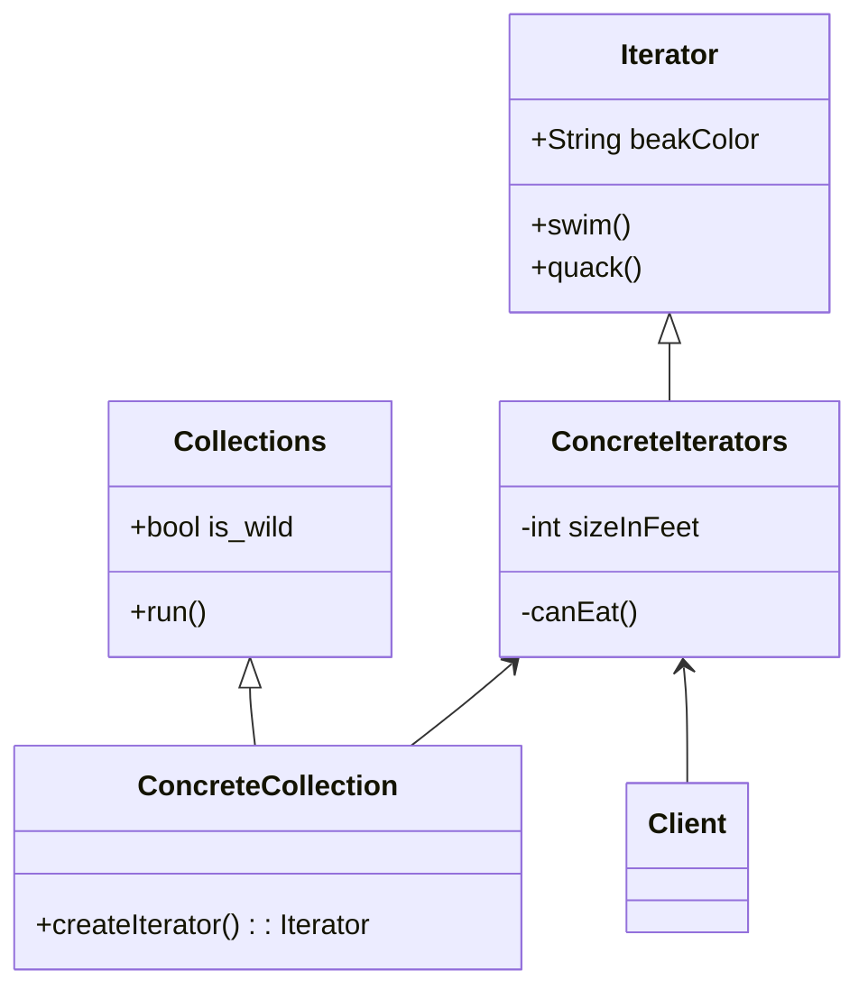

# Strategy

## :bell: Intent
전략은 일련의 알고리즘을 정의하고 각 알고리즘을 별도의 클래스에 넣고 해당 객체를 교환할 수 있도록 하는 행동 디자인 패턴입니다.
전략 패턴에서는 다양한 전략을 나타내는 객체와 전략 객체에 따라 동작이 달라지는 Context 객체를 생성합니다. 전략 객체는 Context 객체의 실행 알고리즘을 변경합니다.

## :bell: Implement  
행동을 정의하는 전략 인터페이스와 전략 인터페이스를 구현하는 구체적인 전략 클래스를 만들 것입니다. 컨텍스트는 전략을 사용하는 클래스입니다.
데모 클래스인 StrategyPatternDemo는 Context 및 전략 개체를 사용하여 배포하거나 사용하는 전략에 따라 Context 동작의 변화를 보여줍니다.

## :bell: Motivation
:cold_sweat:발생 가능한 문제
>컬렉션은 프

:blush:해결책
>Iterator 패턴의 주요 아이디어는 `컬렉션의 순회 동작을 ite`
> 

## :balloon: Structure of classes

`Iterator`
Iterator 인터페이스는 컬렉션 순회에 필요한 작업(다음 요소 가져오기, 현재 위치 검색, 반복 다시 시작 등)을 선언합니다.

`Concrete Iterators`
구체 반복자는 컬렉션 순회를 위한 특정 알고리즘을 구현합니다. iterator 객체는 순회 진행 상황을 자체적으로 추적해야 합니다. 이를 통해 여러 반복자가 서로 독립적으로 동일한 컬렉션을 순회할 수 있습니다.

`Collections`
Collection 인터페이스는 컬렉션과 호환되는 반복자를 얻기 위한 하나 이상의 메서드를 선언합니다. 구체적인 컬렉션이 다양한 종류의 반복자를 반환할 수 있도록 메서드의 반환 유형을 반복자 인터페이스로 선언해야 합니다.

`Concrete Collections`
Concrete Collection 은 클라이언트가 요청할 때마다 특정 구체 반복기 클래스의 새 인스턴스를 반환합니다. 컬렉션의 나머지 코드는 어디에 있습니까? 걱정하지 마십시오. 같은 클래스에 있어야 합니다. 이러한 세부 사항은 실제 패턴에 중요하지 않으므로 생략합니다.

`Client`
일반적으로 client는 자체적으로 반복자를 생성하지 않고 대신 컬렉션에서 가져옵니다. 그러나 어떤 경우에는 클라이언트가 직접 만들 수 있습니다. 예를 들어 클라이언트가 자체 특수 반복기를 정의할 때.

## :balloon: Applicability
(1) 컬렉션의 내부에 복잡한 데이터 구조가 있지만 그 `복잡성을 클라이언트로부터 숨기고 싶을 때` Iterator 패턴을 사용하십시오(`편의`나 `보안`상의 이유로).      
반복자는 복잡한 데이터 구조 작업의 세부 사항을 캡슐화하여 클라이언트에 컬렉션 요소에 액세스하는 몇 가지 간단한 방법을 제공합니다. 이 접근 방식은 클라이언트에게 매우 편리하지만 컬렉션을 직접 사용하는 경우 클라이언트가 수행할 수 있는 부주의하거나 악의적인 작업으로부터 컬렉션을 보호합니다.

(2) 패턴을 사용하여 앱 전체에서 순회 코드의 `중복을 줄이`십시오.      
중요하지 않은 반복 알고리즘의 코드는 매우 부피가 큰 경향이 있습니다. 앱의 비즈니스 로직 내에 배치되면 원래 코드의 책임이 흐려지고 유지 관리가 어려워질 수 있습니다. 순회 코드를 지정된 반복기로 이동하면 애플리케이션 코드를 보다 간결하고 깔끔하게 만들 수 있습니다.

(3) 코드가 다른 데이터 구조를 순회할 수 있기를 원하거나 이러한 구조의 유형을 `미리 알 수 없는 경우` Iterator를 사용하십시오.      
패턴은 컬렉션과 반복자 모두에 대한 몇 가지 일반 인터페이스를 제공합니다. 코드가 이제 이러한 인터페이스를 사용한다는 점을 감안할 때 이러한 인터페이스를 구현하는 다양한 종류의 컬렉션 및 반복자를 전달하면 여전히 작동합니다.

## :balloon: Releations with Other Patterns
- Iterator를 사용하여 `Composite` 트리를 탐색할 수 있습니다.
- Iterator와 함께 `Factory Method` 를 사용하여 컬렉션 하위 클래스가 컬렉션과 호환되는 다양한 유형의 반복자를 반환하도록 할 수 있습니다.
- `Memento`를 Iterator와 함께 사용하여 현재 반복 상태를 캡처하고 필요한 경우 롤백할 수 있습니다.
- `Visitor`는 Iterator와 함께 사용하여 복잡한 데이터 구조를 순회하고 해당 요소에 대해 일부 작업을 실행할 수 있습니다. 모두 다른 클래스가 있더라도 마찬가지입니다.

## :bulb: Java Library
java.util.Comparator#compare(), executed by among others Collections#sort().
javax.servlet.http.HttpServlet, the service() and all doXXX() methods take HttpServletRequest and HttpServletResponse and the implementor has to process them (and not to get hold of them as instance variables!).
javax.servlet.Filter#doFilter()

## :bulb: Example Code
**1) 소셜 네트워크 프로필 반복**
이 예에서 Iterator 패턴은 클라이언트 코드에 통신 세부 정보를 노출하지 않고   
원격 소셜 네트워크 컬렉션의 소셜 프로필을 살펴보는 데 사용됩니다.

**2) 이름 반복**
Iterator 패턴은 이름을 어떤식으로 반복하는지에 대한 세부 정보를 노출하지 않고 
이름 목록을 살펴보는데 사용합니다. 

